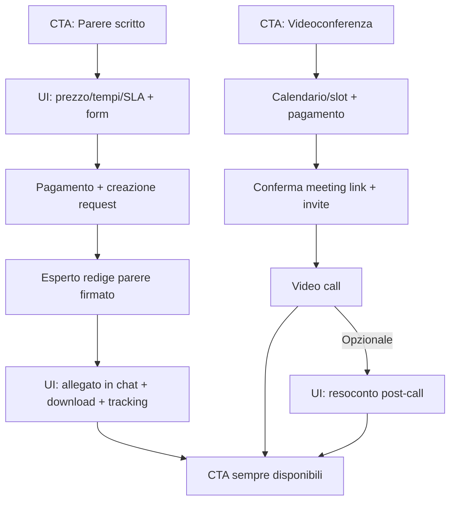
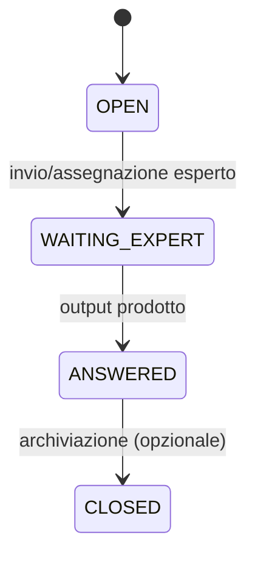

# Flussi – Diagrammi (Mermaid)

> File “solo diagrammi” per knowledge base e discussion.

## D1 – Chat AI + CTA sempre visibili

```mermaid
flowchart TD
  U[Utente: invia prompt] --> P[Platform: pre-check (auth/guardrail)]
  P --> L[LLM: risposta sintetica e accurata]
  L --> UI[Chat UI: mostra risposta AI]
  UI --> CTA[CTA sempre visibili in coda]
  CTA --> V[Richiedi validazione esperto]
  CTA --> S[Richiedi parere scritto]
  CTA --> C[Richiedi consulenza videocall]
  UI --> U2[Utente: continua la chat (opzionale)]
  U2 --> P
```

## D2 – Validazione esperto (2 esiti)

```mermaid
flowchart TD
  CTA1[CTA: Richiedi validazione esperto] --> R1[Platform: crea ExpertRequest(type=VALIDATION)]
  R1 --> SEND[Invia packet a Expert]
  SEND --> E[Esperto valuta]
  E --> A{Esito?}
  A -->|Validato| BADGE[UI: badge "Validato da esperto" sul messaggio AI]
  A -->|Non validato| MSG[UI: messaggio strutturato con punti da chiarire]
  BADGE --> CTA[CTA sempre disponibili]
  MSG --> CTA
```

## D3 – Parere scritto e Videocall



## State machine richiesta esperto (comune)


