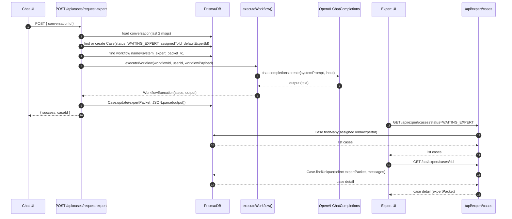

# ARCHIVED

**Superseded by:** `docs/CURRENT_SPEC.md`

**Archived copy:** `docs/archive/2026-01-22_SYSTEM_WORKFLOW_AUDIT.md`

---

# AUDIT — System Workflow `system_expert_packet_v1`

Questo documento descrive **l’implementazione attuale** (stato runtime) del flusso “Richiedi validazione esperto” basato su workflow di sistema **`system_expert_packet_v1`**.

## Scope

- Mappare end-to-end il flusso runtime dal click utente in chat fino a quando l’esperto vede la richiesta nella UI e la apre.
- Identificare endpoint, funzioni principali, ordine di esecuzione.
- Identificare dove viene creato l’oggetto “richiesta” (oggi: `Case`).
- Audit della “finestra JSON su sfondo nero” in UI Expert: dove è renderizzata e da dove arrivano i dati.
- Verificare se il workflow di sistema fa chiamate LLM, dove, con quale modello/provider, prompt, input/output e persistenza.

---

## 1) Sequenza runtime (bullets) — click CTA → expert inbox → dettaglio

### 1.1 UI Chat (click CTA)

1. **Render CTA**
   - File: `components/chat/message-list.tsx`
   - Bottone: "Chiedi parere all’esperto" (CTA equivalente)
   - Logica visibilità/abilitazione:
     - `canShowExpertAction` dipende da:
       - `allowExpertEscalation`
       - `isSubscribed`
       - messaggio ultimo `ASSISTANT`
       - `pendingExpertCaseStatus` (OPEN/WAITING_EXPERT) disabilita
2. **Click CTA → request**
   - Funzione: `handleRequestExpert()` in `components/chat/message-list.tsx`
   - Endpoint chiamato:
     - `POST /api/cases/request-expert`
     - Body JSON: `{ conversationId }`

### 1.2 Backend — creazione/riuso Case + esecuzione workflow

3. **Auth + rate limit + entitlement**
   - File: `app/api/cases/request-expert/route.ts`
   - Funzioni/controlli:
     - `auth()`
     - `checkRateLimit(userId, EXPERT_RPM)`
     - (solo CUSTOMER) verifica subscription attiva

4. **Caricamento conversazione (solo ultimi 2 msg)**
   - Query:
     - `prisma.conversation.findFirst({ include: { messages: { orderBy: desc, take: 2 }}})`
   - Estrazione:
     - `lastUserMessage` e `lastAssistantMessage`

5. **Dedup Case (riuso)**
   - Query:
     - `case.findFirst({ where: { userId, conversationId, status in [OPEN, WAITING_EXPERT] }, orderBy: desc })`
   - Comportamento:
     - se esiste `existingCase` e **ha già** `expertPacket` → ritorna `200` con `{ success:true, caseId, status, reused:true }`

6. **Creazione Case (se necessario)**
   - Create:
     - `case.create({ data: { userId, conversationId, assignedToId, status: WAITING_EXPERT, priority: MEDIUM, triggeredBy: USER_REQUEST }})`
   - Assegnazione esperto:
     - legge `user.defaultExpertId` e lo usa come `assignedToId` (se presente)
     - se Case preesistente non assegnato e ora `defaultExpertId` esiste → `case.update({ assignedToId })`

7. **Costruzione payload per workflow**
   - Variabile: `workflowPayload` (string JSON) in `app/api/cases/request-expert/route.ts`
   - Contenuto principale:
     - `conversationId`, `userId`, `caseId`
     - `user_message` = testo ultima domanda
     - `ai_draft` = testo ultima risposta AI
     - `attachments` = preview metadata da ultimo messaggio utente
     - `citations_block` = blocco estratto da `extractSourcesBlock(lastAssistantMessage.content)`

8. **Lookup workflow di sistema**
   - Query:
     - `prisma.workflow.findMany({ where: { name: 'system_expert_packet_v1', userId: null }, orderBy: desc, take: 1 })`

9. **Esecuzione workflow (orchestrazione)**
   - Funzione:
     - `executeWorkflow(workflowId, userId, workflowPayload)`
   - File:
     - `lib/workflow-executor.ts`

10. **Estrazione output workflow**
    - Funzione:
      - `getWorkflowFinalOutput(execution)` (internamente usata anche per logging)
    - Nel request-expert:
      - prende `workflowExecution.steps[last].output`
      - tenta `JSON.parse(workflowOutput)`
      - se parse fallisce salva fallback:
        - `{ raw_output, parse_error, input }`

11. **Persistenza dossier (expert packet)**
    - Update:
      - `case.update({ data: { expertPacket: expertPacketData, status: WAITING_EXPERT }})`
    - Storico:
      - `caseMessage.create({ role: SYSTEM, content: 'Dossier ...', meta: { workflowId, workflowExecutionId, totalTokens, totalCost, steps }})`

12. **Risposta API al client**
    - `200` con `{ success:true, caseId, status:'WAITING_EXPERT', reused?:true }`

### 1.3 Expert UI — inbox e dettaglio

13. **Lista richieste in inbox expert**
    - Pagina:
      - `app/dashboard/expert/cases/page.tsx`
    - Endpoint chiamato:
      - `GET /api/expert/cases?status=WAITING_EXPERT`
    - Backend:
      - `app/api/expert/cases/route.ts`
      - Query:
        - `case.findMany({ where: { assignedToId: session.user.id, status }, orderBy: createdAt desc })`

14. **Apertura dettaglio case**
    - Click UI (link “Dettagli”):
      - `/dashboard/expert/cases/[id]`
    - Pagina:
      - `app/dashboard/expert/cases/[id]/page.tsx`
    - Endpoint chiamato:
      - `GET /api/expert/cases/[id]`
    - Backend:
      - `app/api/expert/cases/[id]/route.ts`
      - Query:
        - `case.findUnique({ select: { expertPacket, messages(caseMessage), ... }})`
      - AuthZ:
        - `session.user.role === 'EXPERT'` e `found.assignedToId === session.user.id`

15. **Risposta esperto (reply)**
    - Pagina:
      - `app/dashboard/expert/cases/[id]/page.tsx` → `sendReply()`
    - Endpoint:
      - `POST /api/expert/cases/[id]/reply` con `{ content }`
    - Backend:
      - `app/api/expert/cases/[id]/reply/route.ts`
      - Transazione:
        - `caseMessage.create(role=EXPERT)`
        - `message.create(conversationId, role=ASSISTANT, meta.authorType='expert', ...)`
        - `case.update(status='ANSWERED')`

---

## 2) Endpoint chiamati (ordine tipico)

1. `POST /api/cases/request-expert` (Chat CTA)
2. (UI chat per gating) `GET /api/cases/status?conversationId=...` *(quando la conversazione viene caricata in chat e si vuole sapere se c’è un case pending)*
3. `GET /api/expert/cases?status=WAITING_EXPERT` (Expert inbox)
4. `GET /api/expert/cases/:id` (Expert detail)
5. `POST /api/expert/cases/:id/reply` (Expert reply)

---

## 3) Dove viene creata “la richiesta” oggi

### Oggetto creato: `Case`

- File creazione/riuso:
  - `app/api/cases/request-expert/route.ts`
- Model Prisma:
  - `prisma/schema.prisma` → `model Case`

### Campi popolati in `Case.create`

- `userId`: id utente richiedente
- `conversationId`: conversazione target
- `assignedToId`: da `User.defaultExpertId` (se presente) altrimenti `null`
- `status`: `'WAITING_EXPERT'`
- `priority`: `'MEDIUM'`
- `triggeredBy`: `'USER_REQUEST'`

### Campo popolato successivamente

- `expertPacket`: `Json?`
  - valorizzato dopo `executeWorkflow()`

---

## 4) “Finestra con JSON su sfondo nero” — dove, sorgente dati, tipo payload

### Dove viene renderizzata

- **Expert UI**
  - File: `app/dashboard/expert/cases/[id]/page.tsx`
  - Render:
    - `<pre className="bg-slate-900 ...">{JSON.stringify(data.expertPacket ?? null, null, 2)}</pre>`
- **Admin UI (analogo)**
  - File: `app/dashboard/admin/cases/[id]/page.tsx`
  - Render analogo di `data.expertPacket`

### Sorgente dati del JSON

- Origine immediata in UI Expert:
  - Response di `GET /api/expert/cases/[id]`
- Origine backend:
  - `app/api/expert/cases/[id]/route.ts` seleziona `expertPacket` direttamente dal DB (`Case.expertPacket`)
- Persistenza:
  - `Case.expertPacket` viene scritto da `POST /api/cases/request-expert` dopo l’esecuzione del workflow.

### È payload grezzo o sintesi?

- È una **sintesi strutturata** (dossier) che include campi come `summary`, `facts`, `risk_level`, ecc.
- Non è l’intera chat grezza: il payload passato al workflow include **solo** ultima domanda/risposta + metadata allegati + citations block.

### Chi la genera?

- La sintesi/dossier è generata dal **workflow di sistema** `system_expert_packet_v1` tramite un **nodo LLM**.

---

## 5) LLM usato: sì/no, dove, perché

### LLM usato: **SÌ**

#### Dove avviene la call

- Orchestrazione workflow:
  - File: `lib/workflow-executor.ts`
  - Funzione: `executeWorkflow()` → chiama `executeNode()` per ciascun nodo
- Call LLM vera e propria:
  - File: `lib/workflow-executor.ts`
  - Funzione: `executeNode()` nel branch `if (node.type === 'llm')`

#### Provider/modello usato (per `system_expert_packet_v1`)

- Definizione (seed):
  - File: `scripts/seed-expert-workflow.js`
  - Nodo LLM: `llm-expert-analyzer`
  - Dati:
    - `provider: 'OpenAI'`
    - `model: 'gpt-4o-mini'`
    - `temperature: 0.3`
    - `maxTokens: 2000`
    - `customInstruction`: prompt esteso per output JSON dossier

- Esecuzione runtime:
  - File: `lib/workflow-executor.ts`
  - Provider scelto:
    - per `OpenAI` usa `openai.chat.completions.create()` (modello “chat”) se non è un completion model

#### Prompt / system prompt

- Costruzione system prompt (runtime):
  - File: `lib/workflow-executor.ts`
  - `systemPrompt = node.data.customInstruction || ''` + (se presente) `node.data.prompt`

- Prompt contenutistico (seed del workflow):
  - File: `scripts/seed-expert-workflow.js`
  - `customInstruction` contiene regole per produrre un JSON con campi:
    - `summary`, `facts`, `user_question`, `ai_draft_quality`, `missing_info_questions`, `risk_level`, `citations`, `draft_answer`, `expert_actions`, `notes_for_expert`

#### Input usato per la call LLM

- Input passato al nodo LLM è la stringa `workflowPayload` generata in:
  - `app/api/cases/request-expert/route.ts`
- Il payload include:
  - ultima domanda utente (`user_message`)
  - ultima risposta AI (`ai_draft`)
  - metadata allegati (preview)
  - `citations_block` estratto da `SOURCES:`

#### Output salvato

- L’output del nodo LLM (testo) viene:
  - estratto come `workflowOutput`
  - parsato in JSON (se possibile)
  - salvato in:
    - DB → `Case.expertPacket`

- Inoltre viene salvato il log esecuzione workflow (con steps, costi, prompt):
  - File: `lib/workflow-executor.ts`
  - Model: `workflowExecutionLog` (Prisma)

---

## 6) Diagramma minimo (Mermaid)

---

## 7) Tabella: Dato → origine → dove salvato → dove mostrato

| Dato | Origine (runtime) | Dove salvato | Dove mostrato |
|---|---|---|---|
| `conversationId` | Chat UI → `handleRequestExpert()` | in `Case.conversationId` | Expert/Admin case detail header |
| `userId` | `auth()` in `POST /api/cases/request-expert` | in `Case.userId` | Expert/Admin case detail header |
| `assignedToId` | `User.defaultExpertId` (DB) | in `Case.assignedToId` | usato per filtrare inbox expert |
| `status` | logica API case (WAITING_EXPERT/ANSWERED) | in `Case.status` | inbox + detail |
| ultima domanda | `Conversation.messages` (take 2) | non salvata come campo dedicato | inclusa nel `workflowPayload` e poi nel dossier (via LLM) |
| ultima risposta AI | `Conversation.messages` (take 2) | non salvata come campo dedicato | inclusa nel `workflowPayload` e poi nel dossier (via LLM) |
| `citations_block` | `extractSourcesBlock(ai_draft)` | non salvato come campo dedicato | (eventualmente) confluisce in `expertPacket.citations` |
| `workflowPayload` (JSON string) | costruito in `POST /api/cases/request-expert` | salvato come `input` nel `workflowExecutionLog` | non mostrato in UI expert (oggi) |
| `workflow steps` | `executeWorkflow()` | `workflowExecutionLog.steps` | non mostrato in UI expert (oggi) |
| `systemPrompt` effettivo | `executeNode()` | dentro `workflowExecutionLog.steps[*].systemPrompt` | non mostrato in UI expert (oggi) |
| `expertPacket` (dossier) | output LLM di `system_expert_packet_v1` | `Case.expertPacket` (Json) | Expert UI: pre JSON nero; Admin UI: stesso |
| risposta esperto | `POST /api/expert/cases/:id/reply` body `{content}` | `CaseMessage(role=EXPERT)` + `Message(role=ASSISTANT, meta.authorType='expert')` | Chat UI: come messaggio assistant con badge “Risposta dell’esperto” |

---

## 8) File coinvolti (backend + frontend + Prisma)

### Frontend (Chat)
- `components/chat/message-list.tsx` (CTA + chiamata API request-expert)
- `components/chat/chat-interface.tsx` (caricamento conversazione + allowExpertEscalation/pending)

### Backend (Chat / escalation)
- `app/api/cases/request-expert/route.ts` (creazione/riuso Case + esecuzione workflow + salvataggio dossier)
- `app/api/cases/status/route.ts` (gating UI: status case pending per conversazione)

### Workflow execution
- `lib/workflow-executor.ts` (`executeWorkflow`, `executeNode`, call LLM OpenAI/Claude, logging)

### Expert UI + API
- `app/dashboard/expert/cases/page.tsx` (inbox)
- `app/api/expert/cases/route.ts` (lista)
- `app/dashboard/expert/cases/[id]/page.tsx` (dettaglio + JSON window nero)
- `app/api/expert/cases/[id]/route.ts` (dettaglio)
- `app/api/expert/cases/[id]/reply/route.ts` (reply esperto)

### Admin UI (rilevante per dossier)
- `app/dashboard/admin/cases/[id]/page.tsx` (render dossier JSON anche lato admin)

### Prisma schema
- `prisma/schema.prisma` (`Case.expertPacket Json?`, `CaseStatus`, relazioni Case/CaseMessage/Conversation/Message)

### Seed workflow (definizione prompt)
- `scripts/seed-expert-workflow.js` (nodi/edge del workflow + prompt + modello)
